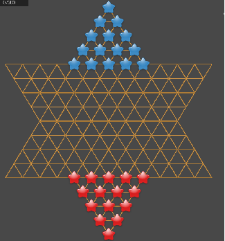

<h1>
stern-halma-plus-client  
</h1>
Client App of Sternhalma Plus (Dual-Engine Mode)

# What is Sternhalma Plus?

Sternhalma Plus is a modified version of Sternhalma, with 2 players and 15 marbles per each player. Sternhalma Plus is only for 2 players, but more interesting and strategical than original version.

# Why Sternhalma Plus?

Stern-halma is a very simple game that can be completely solved. However, simply placing one more marble row significantly increases the complexity of the problem and makes it difficult to find a winning strategy. Therefore, Sternhalma Plus is by no means a game for kids to just enjoy. Please try it, you will feel a totally different game. And you'll love it!

# How to Configure Engine Mode

In the binary output folder, you can find think.config file.
There are three possible enigne modes.

## human

The player is controlled by human.

## local

Built-in AI engine (it is driven by Dajnn)

## server-url

Rely on Flask server from stern-halma-plus

# How to use this source?

   ✅ Place model file in the proper path and rename it (you can find the model file in stern-halma-plus)

   ✅ Place dajnn source codes in the proper directory (you can find them in dajnn)

   ✅ Build the project to produce binary files

   ✅ Configure think.config and enjoy the game
